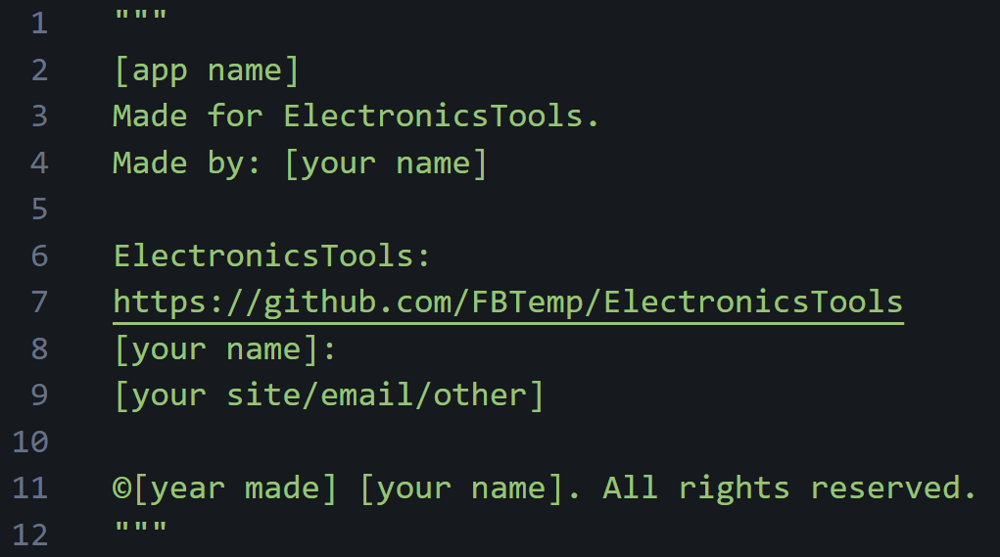

*Note: when I say "we" or "us", I mean the official colaborators.*

# Contributing Guide
Yes, contributing to this program can be difficult, and we do have guidelines, but we will discuss all of the above in this one document to ease up contrubuting. We really appreciate any contributions big or small. We value the importance of having a comunity that has a say in the matters of the project.

**WARNING: READ THE ENTIRE SECTION ABOUT THE PART THAT YOU WANT TO CONTRIBUTE TO BEFORE DOING SO!**

### Table of Contents
* [Tips](https://github.com/FBTemp/ElectronicsTools/blob/main/contributing.md#tips)
* [main.py](https://github.com/FBTemp/ElectronicsTools/blob/main/contributing.md#main.py)
* [Apps](https://github.com/FBTemp/ElectronicsTools/blob/main/contributing.md#apps)
  * [Who owns the apps?](https://github.com/FBTemp/ElectronicsTools/blob/main/contributing.md#who-owns-the-apps)
* [Wiki](https://github.com/FBTemp/ElectronicsTools/blob/main/contributing.md#wiki)

## Tips
To start off, here are some tips:
* Get VSCode and program from there when possible, it really eases up the process.
* Found a bug you don't know how to fix? Report it in the "Issues" tab. (little circle with a dot)
* The best way to contribute to ElectronicsTools is to create an app. [Read More](https://github.com/FBTemp/ElectronicsTools/blob/main/contributing.md#apps)

## main.py
Do not edit [main.py](https://github.com/FBTemp/ElectronicsTools/blob/main/main.py) unless you really know what you're doing. Same goes for [settings.py](https://github.com/FBTemp/ElectronicsTools/blob/main/Config/settings.txt). The slightest mistake in either of the two can ruin the entire project.

## Apps
Feel free to create your own apps for the ElectronicsTools! You can make anything as long as it is in a single python file (yes, you are allowed to use packages). Make sure to make the file under the directory "Apps" and then name it how you want. Add capitalizationto the name if you want, and for spaces use underscores. The app will automatically popup in the main.py app selection list. If you make a app called "My_App.py", then it will show up on the list as "My App". I also would appreciate it if you were to add a color to the text of your app, or something to tell the user that they are not in the main file, for example how [Calculator.py](https://github.com/FBTemp/ElectronicsTools/blob/main/Apps/Calculator.py) has a text "Calculator:" in green in front of everything it outputs.
### Who Owns The Apps
The apps are owned by the developers who made them. **DO NOT EDIT SOMEONE ELSE'S APP WITHOUT THEIR PERMISSION, OR OUR PERMISSION.** Yes, this means that we are also in control of the apps, and by submitting them to the repository, you acknowledge that. An example of the proper legal documentation that should be placed at the beginning of apps. Also can be found at [assets/app_documentation.png](https://github.com/FBTemp/ElectronicsTools/blob/main/assets/app_documentation.png) or [assets/app_documentation.txt](https://github.com/FBTemp/ElectronicsTools/blob/main/assets/app_documentation.txt).

## Wiki
Feel free to contribute to our wiki if you want to. It will help us a lot when we don't have to worry about all of the different guides.

***More information regarding the wiki coming soon.***